# Continuos Integration / Continues Delivery / Continous Deployment

## Requirement
* Persiapkan project yang sebelumnya pernah kita bahas di sesi sebelumnya, jika belum mengambil data bisa lakukan `clone` lagi [disini](github.com/santekno/docker-go)
* Install Docker jika belum kita download terlebih dahulu [disini](https://docs.docker.com/get-docker/).
* Membuat Akun Heroku [disini](https://signup.heroku.com/login) FREE
* Pahami Git Action

## Flow CI / CD
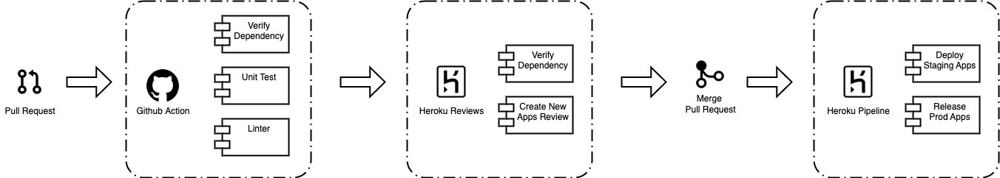

## Buat Git Action Sebagai Continues Integration and Continues Delivery
Pada tahapan ini kita akan membuat project kita akan memiliki integration yang mana nantinya akan ada pengecekan mulai dari unit test, coverage, sampai dengan code analisis akan kita terapkan. Berikut ini tahapannya:

Buat folder `.github/workflows` dan juga buat file dengan nama `audit.yaml` lalu isi file tersebut seperti dibawah ini
```yaml
name: Audit Code Analysis

on:
  pull_request:
    branches: [heroku-ci]

jobs:
  audit:
    runs-on: ubuntu-latest
    steps:
    - uses: actions/checkout@v2

    - name: Set up Go
      uses: actions/setup-go@v2
      with:
        go-version: 1.17

    - name: Verify dependencies
      run: go mod verify

    - name: Build
      run: go build -v ./...

    - name: Run go vet
      run: go vet ./...

    - name: Install staticcheck
      run: go install honnef.co/go/tools/cmd/staticcheck@latest

    - name: Run staticcheck
      run: staticcheck ./...

  test:
    runs-on: ubuntu-latest
    steps: 
      - uses: actions/checkout@v2
      - name: Set up Go
        uses: actions/setup-go@v2
        with:
          go-version: 1.17

      - name: Run tests
        run: make test-coverage

      - name: Upload Coverage report to CodeCov
        uses: codecov/codecov-action@v1.0.0
        with:
          token: ${{secrets.CODECOV_TOKEN}}
          file: ./coverage.txt

  lint:
    runs-on: ubuntu-latest
    steps:
      - uses: actions/checkout@v2

      - name: Set up Go
        uses: actions/setup-go@v2
        with:
          go-version: 1.17

      - name: Verify dependencies
        run: go mod verify

      - name: Install golint
        run: go install golang.org/x/lint/golint@latest

      - name: Run golint
        run: golint ./...
```
Pada file `audit.yaml` adalah beberapa tugas yang berjalan jika kita akan ada perubahan pada code di project kita. Agar lebih paham kita akan bahas satu persatu.

### Trigger Job/Task dijalankan
```yaml
on:
  pull_request:
    branches: [heroku-ci]
```
Pada yaml terdapat seperti diatas ini digunakan untuk `trigger` ketika apa saja job/task yang didefinisikan dibawah ini akan dijalankan. Kalau dilihat disini tertera bahwa akan dijalankan proses job/task dibawahnya itu ketika ada user yang membuat `Pull Request` ke dalam branch `heroku-ci`.

Ketika user membuat maka otomatis semua job/task akan dijalankan untuk mengetahui semua perubahan yang sudah diubah atau diupdate code-nya oleh user tersebut.

### Job/Task Environment Berjalan
```yaml
jobs:
  audit:
    runs-on: ubuntu-latest
    steps:
```
Pada file `audit.yaml` ini akan dijalankan pada environment `ubuntu-latest` yang mana nanti code kita akan dijalankan oleh `runner` (virtual server) dengan tahapan-tahapan yang sudah di tentukan dibawahnya.

### Setup Go, Build project dan lainnya
```yaml
- name: Set up Go
  uses: actions/setup-go@v2
  with:
    go-version: 1.17
```
Tahapan disini kita akan melakukan instalasi setup GO Language dengan versi 1.17

```yaml
- name: Verify dependencies
  run: go mod verify

- name: Build
  run: go build -v ./...
```
Tahapan ini akan menjalankan verifikasi atau beberapa dependency yang dibutuhkan pada project kita dilanjutkan dengan melakukan `build` binary jika beberapa dependency sudah diunduh sebelumnya.

```yaml
- name: Run go vet
  run: go vet ./...
```
Pada run `go vet ./...` ini digunakan untuk mengidentifikasi beberapa kode yang terlihat tidak sesuai dengan aturan golang. Ini bagus dalam menangkap hal-hal di mana kode Kita secara teknis valid tetapi mungkin tidak berfungsi sebagaimana dimaksud. Salah satu contohnya adalah ketika kita memiliki kode yang tidak dapat dijangkau. `go vet` adalah bagian dari instalasi Go standar, membuatnya mudah dijalankan dari baris perintah. Misal bisa dilihat dibawah ini
```go
game_version :=3
fmt.Printf("Super Mario %s\n",game_version)
```
Jika kita `build` maka tidak ada yang salah dalam kode kita dan saat dijalankan pun projek kita akan bisa berjalan tetapi, saat kita lihat ternyata variabel `game_version` ini tidak tampil sebagaimana mestinya. Maka dengan menggunakan `go vet` ini akan mendeteksi kode-kode kita yang tidak sesuai dengan aturan.

### Pengecekan Unit Test & Coverage
```yaml
test:
    runs-on: ubuntu-latest
    steps: 
      - uses: actions/checkout@v2
      - name: Set up Go
        uses: actions/setup-go@v2
        with:
          go-version: 1.17

      - name: Run tests
        run: make test-coverage

      - name: Upload Coverage report to CodeCov
        uses: codecov/codecov-action@v1.0.0
        with:
          token: ${{secrets.CODECOV_TOKEN}}
          file: ./coverage.txt
```
Pada tahapan ini kita juga membuat satu job terpisah yaitu `test` agar nantinya berbarengan paralel menjalankan unit testing pada kode kita yang sudah diupdate atau ada perubahan yang kita lakukan.

Sebelumnya kita perlu membuat dahulu file `Makefile` seperti dibawah ini.
```make
PROJECT_NAME := "docker-go"
PKG := "github.com/santekno/$(PROJECT_NAME)"
PKG_LIST := $(shell go list ${PKG}/... | grep -v /vendor/)
GO_FILES := $(shell find . -name '*.go' | grep -v /vendor/ | grep -v _test.go)
 
.PHONY: all dep lint vet test test-coverage build clean
 
all: build

dep: ## Get the dependencies
	@go mod download

vet: ## Run go vet
	@go vet ${PKG_LIST}

test: ## Run unittests
	@go test -short ${PKG_LIST}

test-coverage: ## Run tests with coverage
	@go test -short -coverprofile cover.out -covermode=atomic ${PKG_LIST} 
	@cat cover.out >> coverage.txt

build: dep ## Build the binary file
	@go build -o docker-go $(PKG)
 
clean: ## Remove previous build
	@rm -f $(PROJECT_NAME)/docker-go
 
help: ## Display this help screen
	@grep -h -E '^[a-zA-Z_-]+:.*?## .*$$' $(MAKEFILE_LIST) | awk 'BEGIN {FS = ":.*?## "}; {printf "\033[36m%-30s\033[0m %s\n", $$1, $$2}'
```


```yaml
- name: Run tests
  run: make test-coverage
```
Job/Task ini menjalankan perintah `make` yang mana pada projek ini kita sudah membuat beberapa `execution` command yang mempermudah pada saat menjalankan perintah. Perintah yang akan dijalankan yaitu perintah `make test-coverage` yang mana disini digunakan untuk menjalankan testing semua file kode lalu menyimpan file coverage yang dihasilkan dari tiap package.

```yaml
- name: Upload Coverage report to CodeCov
  uses: codecov/codecov-action@v1.0.0
  with:
    token: ${{secrets.CODECOV_TOKEN}}
    file: ./coverage.txt
```
Tahapan ini kita lakukan untuk mengupload file coverage yang dihasilkan dari perintah sebelumnya yaitu `test-coverage` ke sebuah third-party yaitu `CodeCov`. Jika kita belum memiliki account di third-party tersebut maka kita perlu membuat account terlebih dahulu dengan mengunjungi web [disini](https://about.codecov.io/).

Kita juga bisa login menggunakan akun [github](github.com) untuk bisa membuat account di third-party CodeCov ini. Jika sudah login dan masuk ke dalam Dashboard, maka kita terlebih dahulu membuat `Access Token` agar nanti hasil coverage unit test kita di upload ke third-party ini. Caranya dengan menuju User -> **Settings** -> **Access** -> **Generate Token** -> Isi Nama Token misal `Token Access Github`.

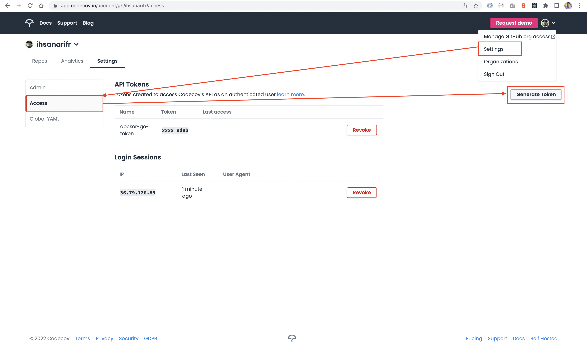

Setelah sukses tergenerate maka `copy` token hasil generate-nya lalu masukkan ke dalam [Secret Repository](https://github.com/santekno/docker-go/settings) kita dengan nama `CODECOV_TOKEN`. Caranya dengan menuju ke Settings -> Secrets -> Actions -> New Repository Secret -> Set name `CODECOV_TOKEN` lalu isi value dengan token yang tadi sudah kita generate.

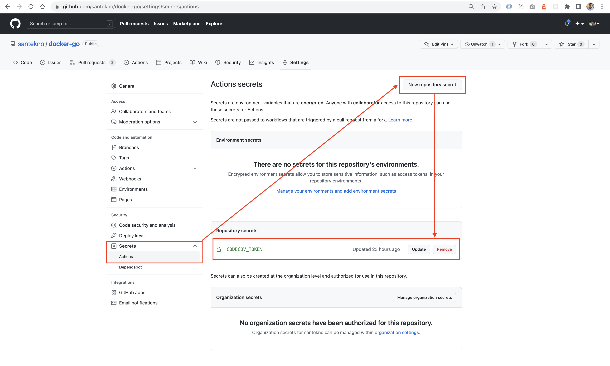

### Pengecekan kode menggunakan Linter
```yaml
lint:
  runs-on: ubuntu-latest
  steps:
    - uses: actions/checkout@v2

    - name: Set up Go
      uses: actions/setup-go@v2
      with:
        go-version: 1.17

    - name: Verify dependencies
      run: go mod verify

    - name: Install golint
      run: go install golang.org/x/lint/golint@latest

    - name: Run golint
      run: golint ./...
```
Job/Task selanjutnya yaitu `Linter` yang mana disini bermanfaat untuk menganalisis code kita yang tidak sesuai aturan dari linter-nya misalkan tata pengelolaan variabel, fungsi yang tidak digunakan, dan banyak hal lainnya. Ini sangat penting untuk kita bisa lebih baik dalam pengerjaan kode terutama di bahasa pemrograman golang.

Setelah semua berjalan dengan baik saatnya kita `commit` semua code changes kita ke dalam sebuah `branch` baru lalu kita akan membuat `Pull Request` untuk memastikan bahwa `Git Action` ini berjalan dengan baik.

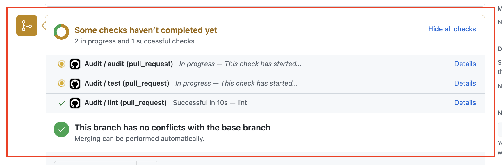

Dan bisa dilihat juga hasil dari third-party akan di post dalam PR tersebut. Kita lihat code coverage pada kode yang sedang kita deploy adalah sudah 100%.

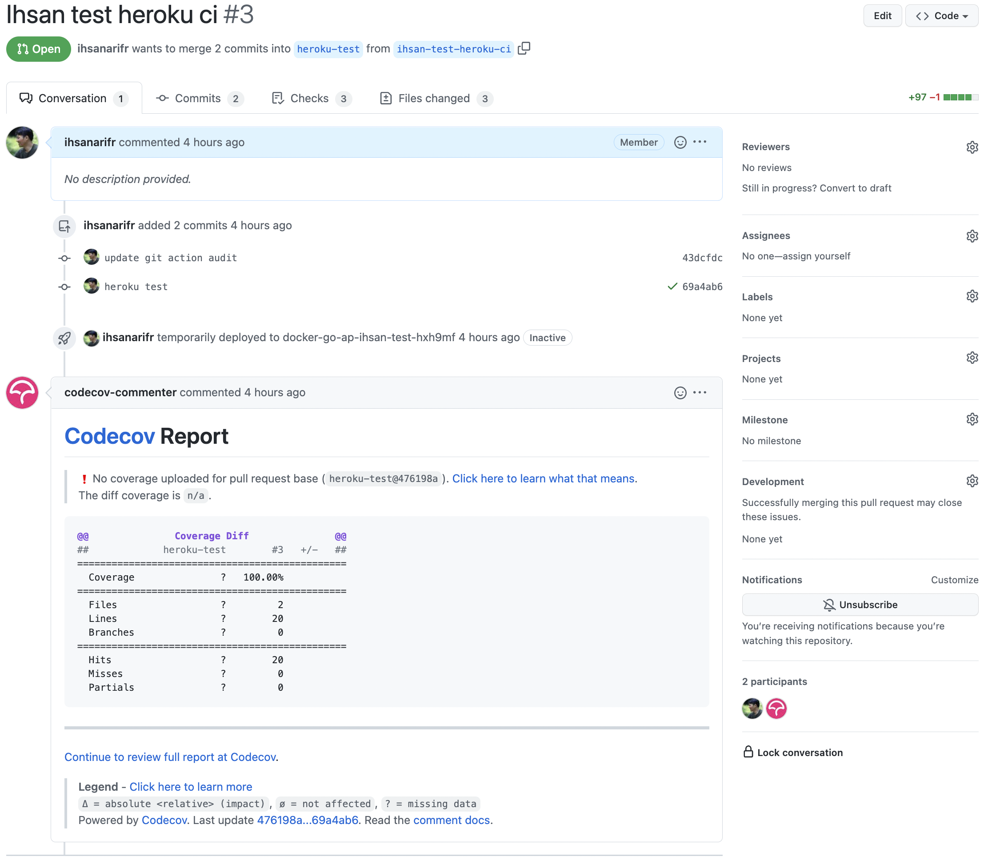


## Persiapan Buat Apps dan Pipeline di Heroku
Pada tahapan ini kita perlu membuat pipeline pada web Heroku yang mana nantinya akan kita hubungkan dengan perubahan-perubahan pada suatu branch di dalam repository kita. Jika sudah login dan memiliki akun Heroku berarti kita tinggal membuat pipeline dengan pilih `New Pipeline`.

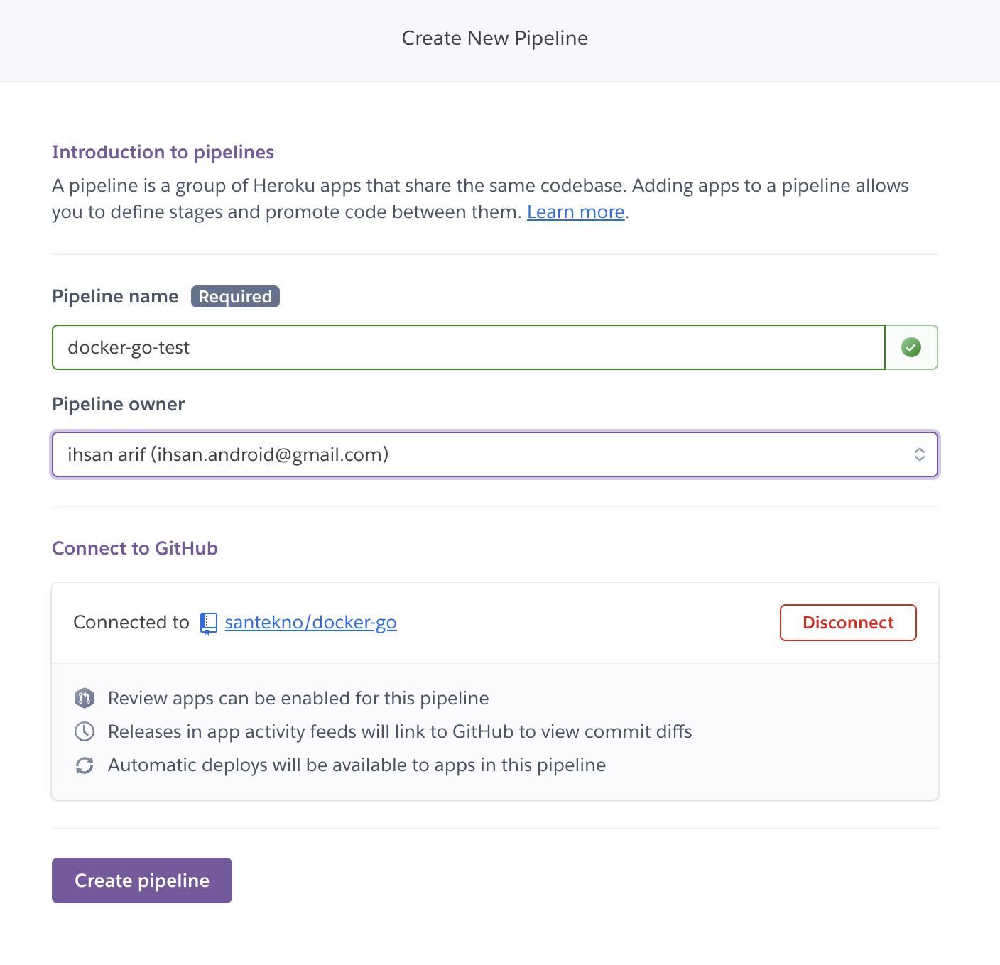

### Mengaktifkan Review Apps
Setelah sukses membuat pipeline di dalam Heroku, selanjutnya kita akan mengaktifkan beberapa fitur yang disupport oleh Heroku diantaranya.

- [x] **Create New Review apps for New Pull Requests** digunakan untuk setiap PR akan ada review dan mengaktifkan new service baru untuk di review
- [x] **Wait for CI to pass**, ini berguna jika semua `github-action` kita di dalam PR tersebut sudah sukses semuanya tanpa ada yang blocker.
- [x] **Destroy state review apps automatically** digunakan agar tiap service yang sudah direview maksimal berjalan setelah berapa hari akan di hapus.


### Membuat Service Apps Staging
Pada tahapan ini kita perlu membuat service apps atau server yang nantinya akan kita deploy untuk projek kita ke dalam service ini. Saat ini kita akan melakukan deploy ke tahapan `staging`. Cara yang dilakukan untuk membuat server di Heroku yaitu dengan pilih **Create New Apps** (Staging) -> isikan **App Name** `docker-go-staging-apps` -> pilih **region** yang diinginkan misalkan `United States` -> lalu pilih **Create app**.

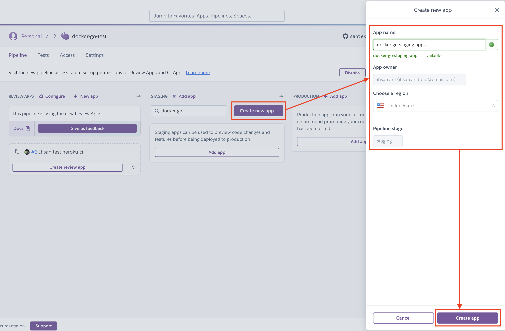

Kita tunggu beberapa menit maka server pun akan terbuat. Lalu kita aktifkan juga auto deploy agar ketika ada changes `commit` ke dalam branch yang sudah kita tentukan maka akan ke `trigger` untuk melakukan deploy ke server tersebut. caranya dengan pilih Configure Automatic Deploy -> pilih branch `heroku-test` -> centang pilihan **Wait for CI to pass before deploy** -> **Enable Automatic Deploys**

Pada pilihan kita centang agar setiap ada integration test yang sedang berjalan ketika ada changes tidak akan melakukan deploy ke server sebelum semua `github-action` sukses.

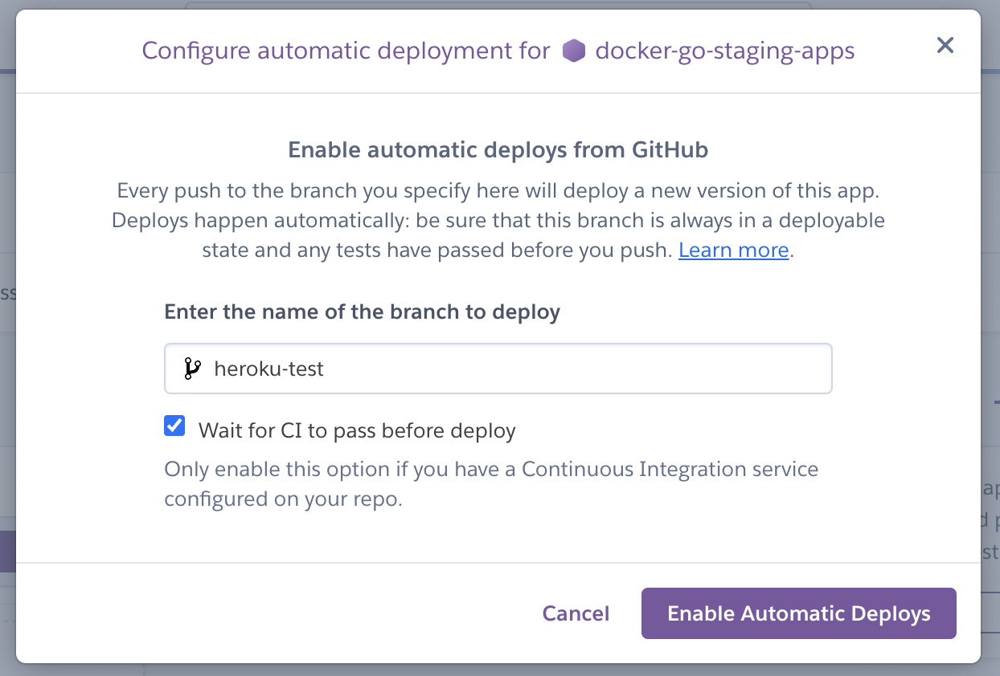

Sebelum kita integrasikan semua tahapan kita perlu terlebih dahulu melakukan testing dengan cara manual deploy berikut seperti yang ada dibawah ini.

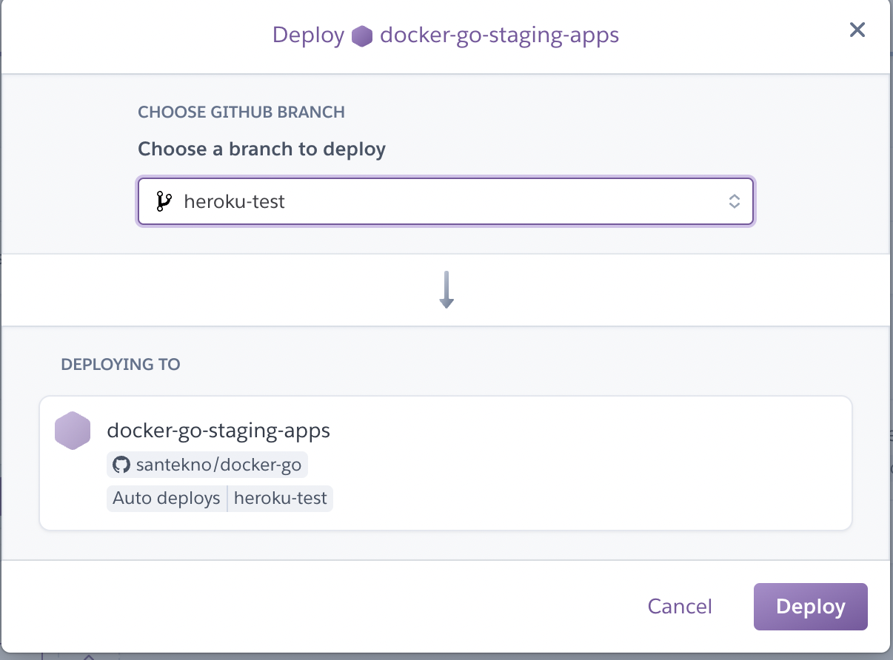

### Ganti Service Apps Staging ke Container
Pada pembuatan service disini secara basic hanya menjalankan sesuai code yang ada di github yang mana ini hanya menjalankan service golang bukan melalui docker container. Jadi perlu kita ganti metode service (server) ini menjadi sebuah container dengan cara sebagai berikut.

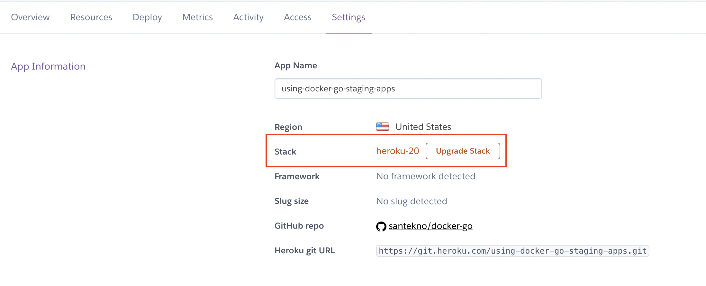

Instal terlebih dahulu Heroku CLI [disini](https://devcenter.heroku.com/articles/heroku-cli) agar lebih mempermudah kita melakukan perubahan method dari suatu service. 

Jika sudah tersedia lakukan login dan akan mengalihkan ke dalam new tab pada browser.
```bash
heroku login -i
```
Berikut jika berhasil dalam command akan seperti ini.
```bash
➜  docker-go git:(heroku-ci) heroku login
heroku: Press any key to open up the browser to login or q to exit: 
Opening browser to https://cli-auth.heroku.com/auth/cli/browser/d84d0c73-95b3-4636-b61c-71cc73051ca3?requestor=SFMyNTY.g2gDbQAAAAwzNi43OS4xMjAuODNuBgDQF2kwggFiAAFRgA.u9K5jR-_B37M_APzkhvLQwYksIG4GABz2x6gQC0iHOE
Logging in... done
Logged in as ihsan.android@gmail.com
```
setelah sukses login kita akan mengganti service (server) aplikasi menjadi method container.

```bash
heroku stack:set container --app using-docker-go-staging-apps
```
sampai terlihat sukses perintah diatas
```bash
Setting stack to container... done
```
Lalu kita lihat di dalam informasi apps server-nya pada web Heroku.

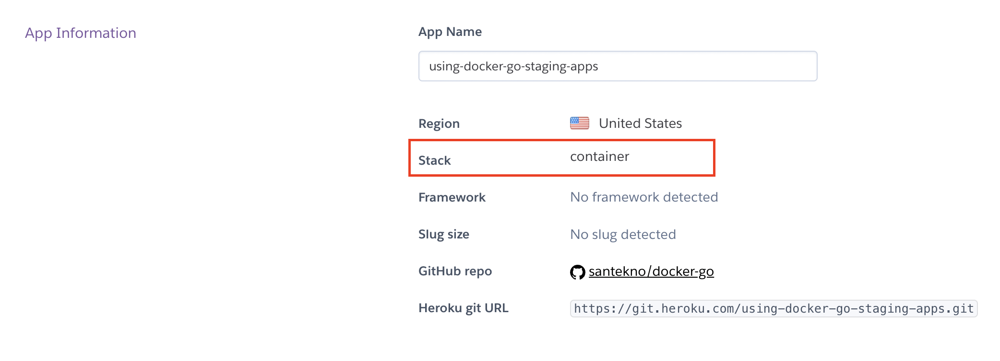

### Pembuatan file heroku.yaml
Dikarenakan service pada staging kita menggunakan docker container untuk deployment-nya maka kita perlu membuat file `heroku.yaml` agar nantinya bisa dideteksi oleh Heroku service ini lalu melakukan build, push, and pull ke dalam registry Heroku. Berikut isi dari `heroku.yaml` dibawah ini.

```yaml
build:
  docker:
    web: Dockerfile.multistage
```

Pada saat ini kita akan menggunakan `Dockerfile.multistage` karena hasil dari build-nya itu lebih ringkas yaitu sekitar 22Mb.
Selanjut-nya kita `commit` ke dalam PR-nya agar bisa kita lanjutkan deploy ke dalam staging yang tadi sudah kita buat.

Jika semua sudah kita lakukan saatnya kita `merge` PR yang sudah kita buat lalu lihat beberapa server akan ter-trigger untuk melakukan deploy secara otomatis karena ada changes pada branch yang dituju.

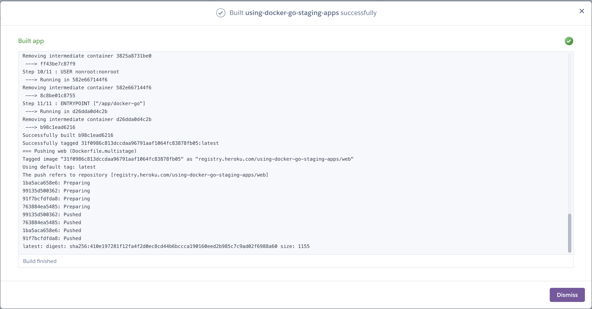

Sukses, maka tinggal kita akses saja API Project kita dengan menggunakan postman atau langsung ke browser pada alamat ini [https://using-docker-go-staging-apps.herokuapp.com/](https://using-docker-go-staging-apps.herokuapp.com/)