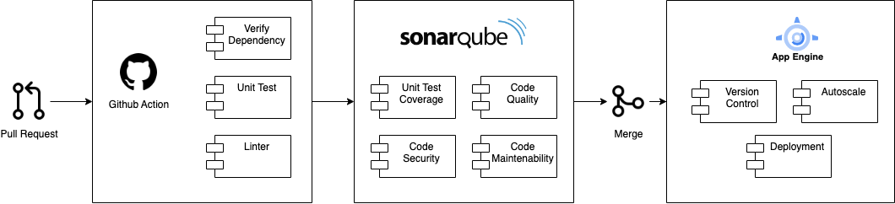
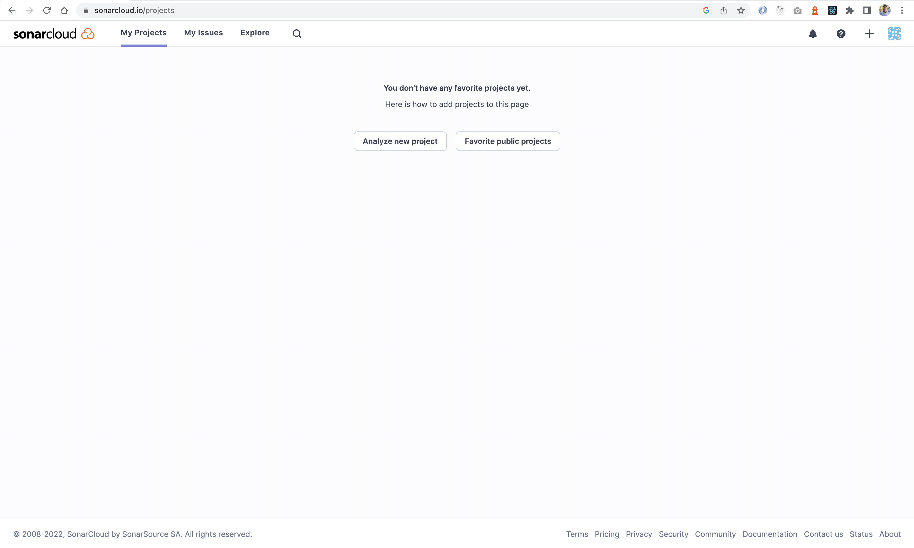

# CI/CD Github Action and GCE (Google Cloud Engine)

## Requirement
* Persiapkan project yang sebelumnya pernah kita bahas di sesi sebelumnya, jika belum mengambil data bisa lakukan `clone` lagi [disini](github.com/santekno/golang-app)
* Membuat Akun Google Cloud [disini](https://console.cloud.google.com/) (Need Credit Card)
* Pahami Git Action

## Flow CI / CD


## Buat Git Action Sebagai Continues Integration and Continues Delivery
Pada tahapan ini kita akan membuat project kita akan memiliki integration yang mana nantinya akan ada pengecekan mulai dari unit test, coverage, sampai dengan code analisis akan kita terapkan. Berikut ini tahapannya:

Buat folder `.github/workflows` dan juga buat file dengan nama `audit.yaml` lalu isi file tersebut seperti dibawah ini
```yaml
name: Audit Code Analysis

on:
  pull_request:
    types: [opened, synchronize, reopened]
  workflow_dispatch:

jobs:
  audit:
    name: Verify Dependency and Build Golang
    runs-on: ubuntu-latest
    steps:
    - uses: actions/checkout@v2
    - name: Set up Go
      uses: actions/setup-go@v2
      with:
        go-version: 1.15
    - name: Verify dependencies
      run: go mod verify
    - name: Build
      run: go build -v ./...
    - name: Run go vet
      run: go vet ./...

  lint:
    runs-on: ubuntu-latest
    needs: [audit]
    steps:
      - uses: actions/setup-go@v3
        with:
          go-version: 1.15
      - uses: actions/checkout@v3
      - name: golangci-lint
        uses: golangci/golangci-lint-action@v3
        with:
          # Optional: version of golangci-lint to use in form of v1.2 or v1.2.3 or `latest` to use the latest version
          version: v1.29

  sonarcloud:
    name: SonarCloud
    runs-on: ubuntu-latest
    needs: [audit, lint]
    steps:
      - uses: actions/checkout@v2
        with:
          fetch-depth: 0  # Shallow clones should be disabled for a better relevancy of analysis
      - name: Set up Go
        uses: actions/setup-go@v2
        with:
          go-version: 1.17
      - name: Get Dependency
        run: go mod verify
      - name: Run Test and Create Report
        run: make test-coverage
      - name: SonarCloud Scan
        uses: SonarSource/sonarcloud-github-action@master
        env:
          GITHUB_TOKEN: ${{ secrets.GITHUB_TOKEN }}  # Needed to get PR information, if any
          SONAR_TOKEN: ${{ secrets.SONAR_TOKEN }}
        with:
          args: >
            -Dsonar.projectKey=santekno_golang-app
            -Dsonar.tests=.
            -Dsonar.exclusions=**/*_test.go,**/vendor/**,**/*mock*.*,**/files/**,**/docker/**,**/models/**
            -Dsonar.go.coverage.reportPaths=cover.out
            -Dsonar.go.tests.reportPaths=cover.out
```
Pada file `audit.yaml` adalah beberapa tugas yang berjalan jika kita akan ada perubahan pada code di project kita. Agar lebih paham kita akan bahas satu persatu.

### Trigger Job/Task dijalankan
```yaml
on:
  pull_request:
    types: [opened, synchronize, reopened]
  workflow_dispatch:
```
Pada yaml terdapat seperti diatas ini digunakan untuk `trigger` ketika apa saja job/task yang didefinisikan dibawah ini akan dijalankan. Kalau dilihat disini tertera bahwa akan dijalankan proses job/task dibawahnya itu ketika ada user yang membuat `Pull Request`.

Ketika user membuat maka otomatis semua job/task akan dijalankan untuk mengetahui semua perubahan yang sudah diubah atau diupdate code-nya oleh user tersebut.

### Job/Task Environment Berjalan
```yaml
jobs:
  audit:
    runs-on: ubuntu-latest
    steps:
```
Pada file `audit.yaml` ini akan dijalankan pada environment `ubuntu-latest` yang mana nanti code kita akan dijalankan oleh `runner` (virtual server) dengan tahapan-tahapan yang sudah di tentukan dibawahnya.

### Setup Go, Build project dan lainnya
```yaml
- name: Set up Go
  uses: actions/setup-go@v2
  with:
    go-version: 1.17
```
Tahapan disini kita akan melakukan instalasi setup GO Language dengan versi 1.17

```yaml
- name: Verify dependencies
  run: go mod verify

- name: Build
  run: go build -v ./...
```
Tahapan ini akan menjalankan verifikasi atau beberapa dependency yang dibutuhkan pada project kita dilanjutkan dengan melakukan `build` binary jika beberapa dependency sudah diunduh sebelumnya.

```yaml
- name: Run go vet
  run: go vet ./...
```
Pada run `go vet ./...` ini digunakan untuk mengidentifikasi beberapa kode yang terlihat tidak sesuai dengan aturan golang. Ini bagus dalam menangkap hal-hal di mana kode Kita secara teknis valid tetapi mungkin tidak berfungsi sebagaimana dimaksud. Salah satu contohnya adalah ketika kita memiliki kode yang tidak dapat dijangkau. `go vet` adalah bagian dari instalasi Go standar, membuatnya mudah dijalankan dari baris perintah. Misal bisa dilihat dibawah ini
```go
game_version :=3
fmt.Printf("Super Mario %s\n",game_version)
```
Jika kita `build` maka tidak ada yang salah dalam kode kita dan saat dijalankan pun projek kita akan bisa berjalan tetapi, saat kita lihat ternyata variabel `game_version` ini tidak tampil sebagaimana mestinya. Maka dengan menggunakan `go vet` ini akan mendeteksi kode-kode kita yang tidak sesuai dengan aturan.

Sebelumnya kita perlu membuat dahulu file `Makefile` seperti dibawah ini.
```make
PROJECT_NAME := "golang-app"
PKG := "github.com/santekno/$(PROJECT_NAME)"
PKG_LIST := $(shell go list ${PKG}/... | grep -v /vendor/)
GO_FILES := $(shell find . -name '*.go' | grep -v /vendor/ | grep -v _test.go)
 
.PHONY: all dep lint vet test test-coverage build clean
 
all: build

dep: ## Get the dependencies
	@go mod download

vet: ## Run go vet
	@go vet ${PKG_LIST}

test: ## Run unittests
	@go test -short ${PKG_LIST}

test-coverage: ## Run tests with coverage
	@go test -short -coverprofile cover.out -covermode=atomic ${PKG_LIST} 
	@cat cover.out >> coverage.txt

build: dep ## Build the binary file
	@go build -o golang-app $(PKG)
 
clean: ## Remove previous build
	@rm -f $(PROJECT_NAME)/golang-app
 
help: ## Display this help screen
	@grep -h -E '^[a-zA-Z_-]+:.*?## .*$$' $(MAKEFILE_LIST) | awk 'BEGIN {FS = ":.*?## "}; {printf "\033[36m%-30s\033[0m %s\n", $$1, $$2}'
```


```yaml
- name: Run tests
  run: make test-coverage
```
Job/Task ini menjalankan perintah `make` yang mana pada projek ini kita sudah membuat beberapa `execution` command yang mempermudah pada saat menjalankan perintah. Perintah yang akan dijalankan yaitu perintah `make test-coverage` yang mana disini digunakan untuk menjalankan testing semua file kode lalu menyimpan file coverage yang dihasilkan dari tiap package.

### Pengecekan kode menggunakan Linter
```yaml
lint:
  runs-on: ubuntu-latest
  steps:
    - uses: actions/checkout@v2

    - name: Set up Go
      uses: actions/setup-go@v2
      with:
        go-version: 1.17

    - name: Verify dependencies
      run: go mod verify

    - name: Install golint
      run: go install golang.org/x/lint/golint@latest

    - name: Run golint
      run: golint ./...
```
Job/Task selanjutnya yaitu `Linter` yang mana disini bermanfaat untuk menganalisis code kita yang tidak sesuai aturan dari linter-nya misalkan tata pengelolaan variabel, fungsi yang tidak digunakan, dan banyak hal lainnya. Ini sangat penting untuk kita bisa lebih baik dalam pengerjaan kode terutama di bahasa pemrograman golang.

Setelah semua berjalan dengan baik saatnya kita `commit` semua code changes kita ke dalam sebuah `branch` baru lalu kita akan membuat `Pull Request` untuk memastikan bahwa `Git Action` ini berjalan dengan baik.


## Publish to Sonarqube
Tahapan ini kita akan melakukan `push` code kita ke dalam `code analysis` agar bisa kita analisis mana yang berpotensi bug, unit test coverage dan yang lainnya.
Sebelum melangkah ke tahapan publish kita perlu terlebih dahulu memiliki akun (registrasi) di [sini](https://sonarcloud.io/login) jika punya github bisa registrasi pakai github account.
Jika sudah registrasi maka akan muncul tampilan seperti ini


Maka, sekarang saatnya project kita untuk di tambahkan didalamnya. Ada beberapa cara diantaranya yaitu
1. Import langsung dari `github` akun kita
2. Create manual project dan organization
Pada tutorial ini kita akan membuat langsung dari import github project. Lalu kita seleksi salah satu project di github akun kita seperti ini.

[Pilih Project](./sonarcloud-seleksi-project.png)

Lanjut ke sonarqube, Untuk itu kita perlu pasang juga publish ke sonarqube ini di file `sonarqube.yml` dengan cara dijalankan setelah proses PR dibuat.
```yaml
name: Sonarqube Scan
on:
  push:
    branches:
      - main
  pull_request:
    types: [opened, synchronize, reopened]
jobs:
  sonarcloud:
    name: SonarCloud
    runs-on: ubuntu-latest
    steps:
      - uses: actions/checkout@v2
        with:
          fetch-depth: 0  # Shallow clones should be disabled for a better relevancy of analysis
      - name: Set up Go
        uses: actions/setup-go@v2
        with:
          go-version: 1.17
      - name: Get Dependency
        run: go mod verify
      - name: Run Test and Create Report
        run: go test -v -short -coverprofile=cover.out ./...
      - name: SonarCloud Scan
        uses: SonarSource/sonarcloud-github-action@master
        env:
          GITHUB_TOKEN: ${{ secrets.GITHUB_TOKEN }}  # Needed to get PR information, if any
          SONAR_TOKEN: ${{ secrets.SONAR_TOKEN }}
        with:
          args: >
            -Dsonar.projectKey=santekno_golang-app
            -Dsonar.sources=.
            -Dsonar.tests=.
            -Dsonar.exclusions=**/*_test.go,**/vendor/**,**/*mock*.*,**/files/**,**/docker/**,**/models/**
            -Dsonar.go.coverage.reportPaths=cover.out
```
Jangan lupa juga tambah dan simpan variabel secret `SONAR_TOKEN` di dalam repo. Dan generate token juga pada aplikasi SonarQube.

Setelah itu kita juga perlu membuat file baru di root project dengan nama `sonar-project.properties` lalu isi file tersebut dengan seperti ini
```properties
sonar.projectKey=santekno_golang-app
sonar.organization=santekno

# This is the name and version displayed in the SonarCloud UI.
#sonar.projectName=golang-app
#sonar.projectVersion=1.0

# Path is relative to the sonar-project.properties file. Replace "\" by "/" on Windows.
#sonar.sources=.

# Encoding of the source code. Default is default system encoding
#sonar.sourceEncoding=UTF-8
```

## Persiapan Google Cloud
Login terlebih dahulu ke [Google Cloud](https://console.cloud.google.com/appengine)
1. Jika baru pertama kali, biasanya dapat Free Tier selama setahun untuk mencoba
2. Buat Project baru seperti dibawah ini
[Create Project](./gcloud-new-project.png)

3. Pilihlah di menu bar kiri `App Engine` dan enable terlebih dahulu jika masih OFF
4. Jika sudah di `Enable` maka App Engine kita sudah bisa dipergunakan
[App Engine Google Cloud](./gcloud-app-engine.png)

## Memasang Deploy ke App Engine pada Github Action
1. Buat file `deploy-cge.yml`, untuk menyimpan github-action di dalam repository kita.
2. Tambahkan code dibawah ini pada file tersebut
```yaml
...
...
...
deploy:
    name: Deploying to Google Cloud
    runs-on: ubuntu-latest
    needs: [audit, lint, sonarcloud]
    steps:
    - name: Checkout
      uses: actions/checkout@v2
    - name: Setup Google Cloud SDK
      uses: google-github-actions/setup-gcloud@v0.2.0
      with:
        project_id: ${{ secrets.GCP_PROJECT }}
        service_account_key: ${{ secrets.GCP_CREDENTIALS }}
    - name: Deploy to App Engine
      id: deploy
      uses: google-github-actions/deploy-appengine@v0.2.0
      with:
        deliverables: app.yaml
        version: v1
        project_id: ${{ secrets.GCP_PROJECT }}
        credentials: ${{ secrets.GCP_CREDENTIALS }}
```
    Pada tahapan sebelumnya seperti `audit, lint, sonarcloud` ini sudah ditambahkan sebelumnya sehingga saat deploy kita akan melakukan hal yg serupa juga.
3. Tambahkan di repository kita secrets dibawah ini
   ```cmd
   GCP_PROJECT=<nama project yang sudah dibuat>
   GCP_CREDENTIALS=<iam atau service account>
   ```
4. Tambahkan file `app.yaml` untuk konfigurasi dari App Engine-nya. Bisa dilihat dibawah ini
```yaml
runtime: go115 
service: golang-app-engine
instance_class: B1
basic_scaling:
  max_instances: 1
  idle_timeout: 10m
```