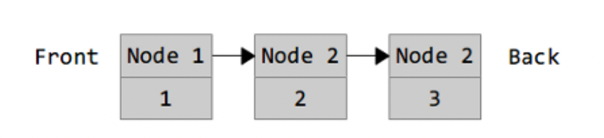

# Mengenal Container List dan Sort

Selain `arrays` dan `maps`, Go memiliki beberapa koleksi lagi yang tersedia di bawah paket kontainer. Kita akan melihat paket `container/list` sebagai contoh.

## Package `List`
Library `container/list` mengimplementasikan `list` yang tertaut ganda. `list` tertaut atau sering kita bilang **Linked List** adalah tipe struktur data yang terlihat seperti ini:


Setiap node dari `list` berisi nilai (1, 2, atau 3 dalam kasus ini) dan penunjuk ke node (titik) berikutnya. Karena ini adalah `list` yang ditautkan ganda (double linked list), setiap node juga akan memiliki pointer ke node sebelumnya. `list` ini dapat dibuat dengan program dibawah ini.
```go
package main

import ("fmt" ; "container/list")

func main() {
     var x list.List
     x.PushBack(1)
     x.PushBack(2)
     x.PushBack(3)
     for e := x.Front(); e != nil; e=e.Next() {
           fmt.Println(e.Value.(int))
} }
```
Maka bisa kita lihat hasilnya jika kita jalankan program diatas
```bash
➜  12-libary-container-sort git:(main) ✗ go run main.go 
1
2
3
```
Nilai nol untuk list adalah list kosong (*list juga dapat dibuat menggunakan `list.New`). Nilai ditambahkan ke list menggunakan fungsi `PushBack`. Kita mengulang setiap item dalam list dengan mendapatkan element pertama, dan mengikuti semua tautan sampai kita mencapai `nil`.

## Package `Sort`
Packag `sort` berisi fungsi untuk menyortir data sesuai dengan kebutuhkan kita. Ada beberapa fungsi penyortiran yang telah ditentukan sebelumnya (untuk `int` dan `float`). Berikut ini contoh cara mengurutkan data kita.
```go
package main

import (
	"fmt"
	"sort"
)

type Orang struct {
	Nama string
	Umur int
}
type ByNama []Orang

func (this ByNama) Len() int {
	return len(this)
}
func (this ByNama) Less(i, j int) bool {
	return this[i].Nama < this[j].Nama
}
func (this ByNama) Swap(i, j int) {
	this[i], this[j] = this[j], this[i]
}

func main() {
	kids := []Orang{
		{"Jill", 9},
		{"Jack", 10},
	}
	sort.Sort(ByNama(kids))
	fmt.Println(kids)
}
```
Fungsi `Sort` didalam `sort` package mengambil `sort.Interface` dan mengurutkannya. `Sort.Interface` membutuhkan 3 metode: `Len`, `Less` dan `Swap`. Untuk menentukan pengurutan kita sendiri, kita membuat tipe baru (ByName) dan membuatnya setara dengan sepotong dengan sepotong dari apa yang ingin kita urutkan. Kemudian kita mendefinisikan 3 metode.

Kita juga bisa mengurutkan data `kids` tersebut berdasarkan usia. Maka, kita juga perlu mendefinisikan tipe `ByUmur` agar sorting-nya disesuaikan dengan umur dari data orang-orang. Berikut dibawah ini perlu kita tambahkan.
```go
type ByUmur []Orang

func (this ByUmur) Len() int {
	return len(this)
}
func (this ByUmur) Less(i, j int) bool {
	return this[i].Umur < this[j].Umur
}
func (this ByUmur) Swap(i, j int) {
	this[i], this[j] = this[j], this[i]
}
```