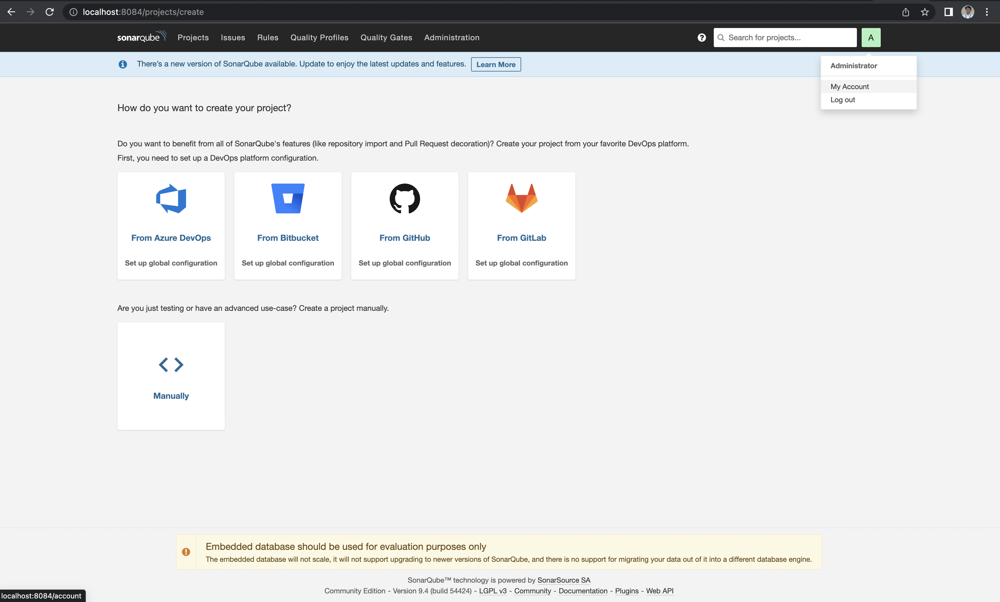
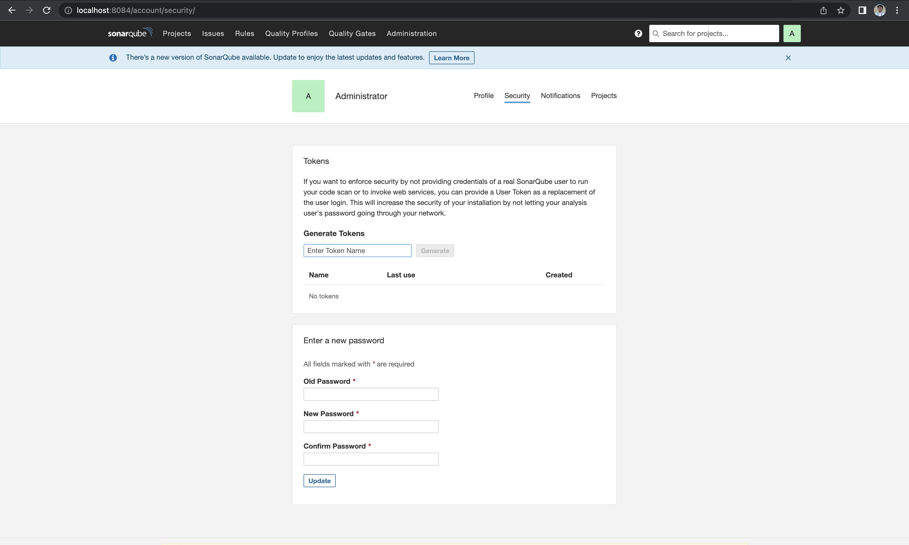
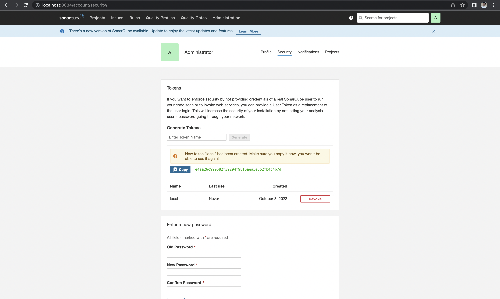

# Code Analysis Golang Menggunakan SonarQube

## Requirement
* Install Docker
* Install Install SonarQube Commnunity
* Install Java
* Install sonar-scanner-cli


## Pengenalan SonarQube

## Cara Install SonarQube Community Menggunakan Docker di local
* Pastikan sudah install docker dengan versi yang terbaru
* Ambil SonarQube Community untuk kebutuhan analisi dengan cara
    ```bash
    docker pull mwizner/sonarqube:9.4.0-community
    ```
* Jika sudah selesai download docker image-nya, kita langsung jalankan docker image tersebut dengan cara:
    ```bash
    docker run -d -p 8084:9000 --name sonarqube mwizner/sonarqube:9.4.0-community
    ```
* Lalu akses di browser ke `http://localhost:8084/sessions/new?return_to=%2F` login dengan username: `admin` dan password : `admin`. Setelah itu akan diarahkan untuk mengganti password yang lama ke yang baru.
* Isi saja password sesuai dengan kebutuhan kita
* Selamat kita sudah masuk ke dalam Dashboard SonarQube

## Generate Token Sebagai Akses Code ke SonarQube
* Masuk ke MyAccount untuk lihat configurasi 

* Pilih Tab Security -> Isi Nama Token

* Pilih Generate Token dan Simpan Kode Token tersebut untuk digunakan pada saat publish code ke SonarQube.


## Publish Code Analysis ke SonarQube Community
* Buat file `sonarcube.sh`
* Masukkan script ini di dalam file tersebut
    ```bash
    echo Token: $1

    go test -v -short -coverprofile=cover.out ./...

    sonar-scanner   -Dsonar.projectKey=mocking-unit-test   \
        -Dsonar.sources=.   \
        -Dsonar.host.url=http://localhost:8084  \
            -Dsonar.login=$1 \
            -Dsonar.exclusions=**/*loadtest*.go,**/docker/**,**/*.py,**/*mock*/**,**/_mocks/**,**/*_easyjson.go,**/src/db_modles/**,**/db_models/**,**/testfile/**,**/acceptancetest/**,**/*.html.go,**/*_test.go,**/*.java,**/vendor/**,**/*.js,**/*.jsx,**/*.ts,**/*.html,**/*.css,**/*.scss,**/*mock*.*,**/mock/**,**/mocks/**,**/files/**,**/dummy/**,**/testgenerator/**,wire.go,wire_gen.go,**/testdata/**,**/cmd/**,**/test/**,**/*.pb.go,**/constant/**,**/constants/**,**/const/**,**/cons/**,**/types/**,**/*types*.go,**/*type*.go,**/*constant*.go,**/*const*.go,**/*cons.go,**/dummy_*.go,**/docker/**,**/docs/**,**/models/**,**/*_models/**,**/dbmodels/**,**/mocking/** \
        -Dsonar.go.coverage.reportPaths=cover.out -X

    ```
* Tambahkan akses executable untuk file `sonarqube.sh` dengan perintah `chmod +x sonarqube.sh`
* Eksekusi perintah ini `./sonarqube.sh <token>`
* Tunggu beberapa menit sampai tampil eksekusi sukses dengan melihat hasil terakhir seperti ini.
    ```bash
    19:44:07.686 INFO: Analysis total time: 4.778 s
    19:44:07.688 INFO: ------------------------------------------------------------------------
    19:44:07.688 INFO: EXECUTION SUCCESS
    19:44:07.688 INFO: ------------------------------------------------------------------------
    19:44:07.688 INFO: Total time: 9.831s
    19:44:07.714 INFO: Final Memory: 15M/57M
    19:44:07.714 INFO: ------------------------------------------------------------------------
    ```

* Selesai, lihat di dahsboard sonarcube code kita sudah ter-publish ke SonarQube lokal.
