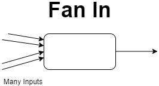
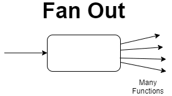

# Fan In & Fan Out

## Implementasi Fan In

**Fan In** adalah adalah pattern concurrency yang mengambil beberapa masukan dan menggunakannya dalam satu channel. **Fan In** Pattern bekerja seperti **multiplexer**. Ini dia visualisasi sederhana dari **Fan In**.



Baiklah, kita langsung mencoba mengimplementasikan menggunakan program sederhana. Pertama kita akan membuat fungsi producer dengan parameter channel.
```go
func producer(ch chan<- int, name string) {
	for {
		// sleep some random time
		sleep()

		// generate a random number
		n := rand.Intn(100)

		// send message
		fmt.Printf("Channel %s -> %d\n", name, n)
		ch <- n
	}
}
```
Yang mana disini juga memanggil fungsi `sleep` untuk melakukan delay dalam waktu yang random.
```go
func sleep() {
	time.Sleep(time.Duration(rand.Intn(3000)) * time.Millisecond)
}
```
Fungsi `producer` ini kita buat untuk mengirimkan data berupa `int` dengan nilai yang sudah di generate oleh fungsi `rand.Intn(100)` yang mana artinya kita akan mengenerate random angka dari 1-100. Lalu setelah di generate nilai angka tersebut akan kita kirim ke dalam channel `ch`.

Selanjutnya kita akan buat fungsi untuk menerima data yang dikirim oleh fungsi `producer`. Berikut ini kita buat fungsi seperti dibawah ini.
```go
func consumer(ch <-chan int) {
	for n := range ch {
		fmt.Printf("<- %d\n", n)
	}
}
```
Setelah kedua fungsi ini kita buat, maka kita perlu satu fungsi lagi untuk mengatur semua pengiriman dan pengeluaran data sesuai dengan Pattern `Fan In`. Mari kita lihat implementasinya seperti dibawah ini.
```go
func fanIn(chA, chB <-chan int, chC chan<- int) {
	var n int
	for {
		select {
		case n = <-chA:
			chC <- n
		case n = <-chB:
			chC <- n
		}
	}
}
```
Bisa kita lihat aturan `Fan In` adalah menerima beberapa channel yang diinput lalu akan dikeluarkan dalam satu output. Disini kita lihat parameter channel input terdapat `chA` dan `chB` lalu kita akan mengirimkan data tersebut dalam channel `chC`.

Terakhir, kita implementasikan fungsi `main` sebagai berikut.
```go
func main() {
	chA := make(chan int)
	chB := make(chan int)
	chC := make(chan int)

	go producer(chA, "A")
	go producer(chB, "B")
	go consumer(chC)

	fanIn(chA, chB, chC)
}
```
Pada `main` program kita akan membuat beberapa channel inisialisasi yang mana kita akan mengirim channel `chA` dan `chB` lalu akan di terima pada channel `chC`. lalu dilakukan operasi `select` untuk menggabungkan dari tiap channel pengiriman tersebut menjadi mengembalikan satu output.
```bash
➜  fan-in git:(main) ✗ go run main.go 
Channel B -> 47
<- 47
Channel B -> 81
<- 81
Channel A -> 25
<- 25
Channel B -> 56
<- 56
Channel B -> 94
<- 94
Channel B -> 62
<- 62
Channel B -> 28
<- 28
Channel B -> 11
<- 11
Channel A -> 37
<- 37
```
Berdasarkan kode yang ditampilkan diatas, data akan dimasukkan ke dalam 2 channel yaitu channel A dan channel B. Selanjutnya dicetak dengan channel C yang mana hanya channel C saja yang akan mencetak semua masukkan data dari berbagai channel.

Hasil dari output disini akan diterima oleh `chC` yang mana peranan fungsi `fanIn()` ini berguna untuk mengembalikan data dari berbagai channel.

## Implementasi Fan Out
**Fan Out** Pattern merupakan *concurrency pattern* dimana banyak fungsi dapat membaca dari channel yang sama hingga channel tersebut ditutup. Biasanya pattern **fan in** dan **fan out** dapat digunakan secara bersamaan. Ini dia visualisasi sederhana dari **Fan Out**.



Lanjut kita akan mencoba mengimplementasikan sesederhana mungkin agar kita bisa lebih memahami proses bagaimana fan-out ini bisa dilakukan.

Kita akan menggunakan program sebelumnya seperti fungsi dari `sleep`, `producer`, dan `consumer` tetapi ada beberapa yang perlu diubah yaitu pada fungsi `producer` kita perlu ubah seperti ini.
```go
func producer(ch chan<- int) {
	for {
		// sleep some random time
		sleep()

		// generate a random number
		n := rand.Intn(100)

		// send message
		fmt.Printf(" -> %d\n", n)
		ch <- n
	}
}
```
Lalu kita akan ubah juga pada fungsi `consumer` seperti dibawah ini.
```go
func consumer(ch <-chan int, name string) {
	for n := range ch {
		fmt.Printf("consumer %s <- %d\n", name, n)
	}
}
```
Dan selanjutnya update fungsi `fanIn()` menjadi `fanOut()` dengan isi fungsi yang berbeda. Berikut kita lihat implementasinya dibawah ini.
```go
func fanOut(chA <-chan int, chB, chC chan<- int) {
	for n := range chA {
		if n < 50 {
			chB <- n
		} else {
			chC <- n
		}
	}
}
```
Jika dilihat dari fungsi `fanOut` bisa kita lihat bahwa data yang dikirim melewati channel `chA` lalu data tersebut akan diterima oleh beberapa channel yang mana pada program ini yaitu channel `chB` dan `chC`.

Lalu selain buat fungsi `fanOut` kita juga ada beberapa implementasi yang perlu kita ganti di fungsi `main`. Berikut ini perubahannya dibawah ini.
```go
func main() {
	chA := make(chan int)
	chB := make(chan int)
	chC := make(chan int)

	go producer(chA)
	go consumer(chB, "A")
	go consumer(chC, "B")

	fanOut(chA, chB, chC)
}
```
Program `fan out` sudah selesai, saatnya kita coba jalankan dan kita lihat bagaimana output dari program `fan out` ini.
```bash
➜  fan-out git:(main) ✗ go run main.go 
 -> 87
consumer B <- 87
 -> 59
consumer B <- 59
 -> 18
consumer A <- 18
 -> 40
consumer A <- 40
 -> 0
consumer A <- 0
 -> 11
consumer A <- 11
 -> 89
consumer B <- 89
```

Berdasarkan kode yang dibuat diatas, `fan out` digunakan untuk **multi output** yang mana jika terdapat data yang dimasukkan dalam satu channel, maka nantinya akan di proses oleh beberapa channel yang sudah disediakan. Dalam kode ini, channel yang memproses adalah `chA` dan `chB`.