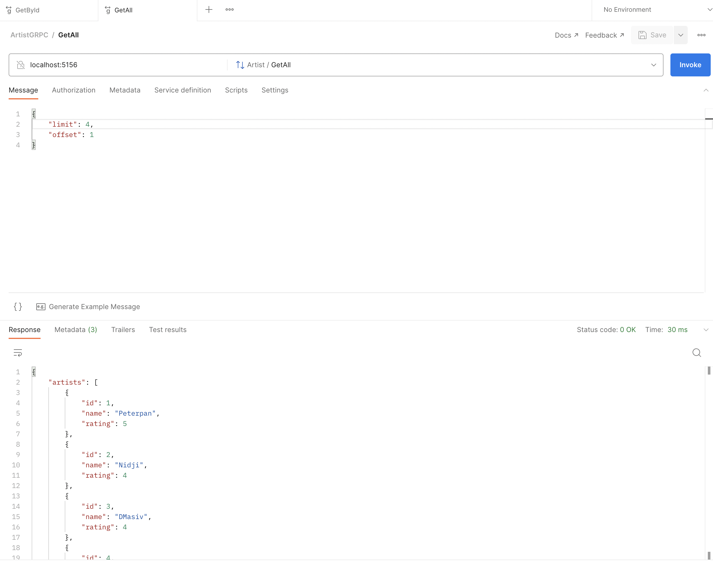

# Microservice using gRPC

## Persiapan
* `GrpcArtist` service (Bahasa C# dotnet) sebagai Server
* `final-project-api` service (Bahasa Golang) sebagai client
* Install terlebih dahulu [.Net Framework](https://dotnet.microsoft.com/en-us/download/dotnet-framework)
* Intall juga `protobuf` untuk kebutuhan generate client pada bahasa Golang
```bash
brew install protobuf
```

## Menjalankan `GrpcArtist` Project sebagai Server GRPC
1. Download terlebih dahulu project `GrpcArtist` [ini](https://github.com/santekno/tutorial-go/tree/main/microservice-design/GrpcArtist), pastikan semuanya terdownload
2. Jalankan perintah dibawah ini
```bash
dotnet build
```
3. Tunggu beberapa detik untuk mendownload semua dependency yang dibutuhkan pada project tersebut.
4. Jika sudah selesai, maka jalankan juga perintah dibawah ini untuk menjalankan project-nya
```bash
dotnet run
```
5. Tampilan dibawah ini menandakan bahwa project sudah bisa berjalan dengan baik dengan address dan port : `localhost:5156`
```bash
  Building...
  info: Microsoft.Hosting.Lifetime[14]
        Now listening on: http://localhost:5156
  info: Microsoft.Hosting.Lifetime[0]
        Application started. Press Ctrl+C to shut down.
  info: Microsoft.Hosting.Lifetime[0]
        Hosting environment: Development
  info: Microsoft.Hosting.Lifetime[0]
        Content root path: /Users/ihsanarif/Documents/ihsan/tutorial/tutorial-go/microservice-design/GrpcArtist/
```
6. Lalu lakukan testing menggunakan postman



## Mengintegrasikan ke dalam Project Golang
1. Download project golang pada folder `final-project-api`
2. Jalankan perintah dibawah ini, untuk mengambil beberapa dependency yang dibutuhkan
```bash
go mod vendor
```
3. Jika sudah selesai, maka project kita bisa dijalankan dengan baik dengan perintah dibawah ini untuk menjalankannya
```bash
go build && ./final-project-api
```

Tampilan dibawah ini akan tampil jika sudah dijalankan project golang tersebut
```bash
➜  final-project-api git:(main) ✗ go build && ./final-project-api 
[GIN-debug] [WARNING] Creating an Engine instance with the Logger and Recovery middleware already attached.

[GIN-debug] [WARNING] Running in "debug" mode. Switch to "release" mode in production.
 - using env:   export GIN_MODE=release
 - using code:  gin.SetMode(gin.ReleaseMode)

setting limits
[GIN-debug] GET    /api/v1/albums/           --> final-project-api/internal/handler/album.AlbumHandler.GetAllAlbum-fm (3 handlers)
[GIN-debug] POST   /api/v1/albums/           --> final-project-api/internal/handler/album.AlbumHandler.Create-fm (3 handlers)
[GIN-debug] POST   /api/v1/albums/batch      --> final-project-api/internal/handler/album.AlbumHandler.BatchCreate-fm (3 handlers)
[GIN-debug] GET    /api/v1/albums/:id        --> final-project-api/internal/handler/album.AlbumHandler.Get-fm (3 handlers)
[GIN-debug] PUT    /api/v1/albums/:id        --> final-project-api/internal/handler/album.AlbumHandler.Update-fm (3 handlers)
[GIN-debug] DELETE /api/v1/albums/:id        --> final-project-api/internal/handler/album.AlbumHandler.Delete-fm (3 handlers)
[GIN-debug] [WARNING] You trusted all proxies, this is NOT safe. We recommend you to set a value.
Please check https://pkg.go.dev/github.com/gin-gonic/gin#readme-don-t-trust-all-proxies for details.
[GIN-debug] Listening and serving HTTP on 0.0.0.0:8090
```
Project ini akan berjalan pada address dan port `localhost:8090` tentunya ini bisa kita ubah sesuai dengan kebutuhan dengan cara mengubah file `.env`.

4. Oh iya, jangan lupa juga didalam project yg ini saat kita download biasanya hanya ada file `.env.sample` maka copy file tersebut menjadi file `.env` lalu isi file tersebut seperti dibawah ini
```bash
POSTGRES_URL=postgres://<user>:<password>@localhost/recordings?sslmode=disable #isi <user> dan <password> sesuai setting yang dibuat
REDIS_URL=<redis-url>:<redis-port> # disiapkan jika menggunakan redis
PORT=8090 #port ini untuk server golang
GRPC_ARTIST_URL=<grpc-call-url>:<grpc-call-port> # isi url yang sudah diset pada dotnet server
```

### Generate Protobuf pada Golang Project
Hal yang perlu diperhatikan pertama kali yaitu bagaimana caranya gRPC server yang sudah kita buat menggunakan bahasa `dotnet` bisa dikomunikasikan ke dalam project golang kita saat ini. Tahapan yang pertama kita perlu `.proto` kontrak agar bisa kita generate sesuai dengan bahasa golang, dengan cara
1. Copy `artist.proto` pada project `GrpcArtist` ke dalam project `final-project-api` simpan di dalam folder `internal/proto`.
2. Tambahkan pada file `artist.proto` option untuk package golang
```protobuf
option go_package="internal/proto";
```
3. Jika sudah ditambahkan simpan dan lakukan perintah ini agar `generate` protobuf dijalankan
```bash
protoc --go_out=plugins=grpc:. internal/proto/artist.proto
```
4. Jika sudah berhasil maka akan terbuat file baru dengan nama `artist.pb.go` dengan isi generate `client function` dan `initial new client` untuk kebutuhan project-nya.
```bash
.
├── internal
│   ├── proto
│   │   ├── artist.pb.go
│   │   └── artist.proto
```

### Membuat Initial Koneksi ke gRPC Server
1. Buat file baru `grpc.go` pada folder `internal/config`
2. Isi file tersebut dengan code dibawah ini
```go
package config

import (
	"log"

	proto "final-project-api/internal/proto"

	"google.golang.org/grpc"
)

// open connection into grpc artist service
func ServiceGrpcArtist(grpcUrl string) proto.ArtistClient {
	conn, err := grpc.Dial(grpcUrl, grpc.WithInsecure())
	if err != nil {
		log.Fatal("could not connect to", grpcUrl, err)
	}

	return proto.NewArtistClient(conn)
}
```
Fungsi ini nanti akan kita panggil untuk kebutuhan koneksi ke gRPC pada initial project-nya atau nanti kita panggil di dalam file `main.go`. Tetapi sebelum itu kita perlu buatkan juga tahapan berikutnya.

### Membuat `Entity` untuk Artist Model
Menampung data entity model Artist belum tersedia pada project ini, maka kita perlu terlebih dahulu untuk membuat model data baru ini, dengan cara membuat file baru `artist.go` pada direktory `internal/entity`. Lalu isi file tersebut dengan code dibawah ini.
```go
package entity

// The entity will be used for artist definition
type Artist struct {
	ID     int64  `json:"id"`
	Name   string `json:"name"`
	Rating int    `json:"rating"`
}
``` 
### Membuat `Repository` call gRPC Artist
Tahapan ini kita akan membuat repository yang bisa mengakses ke gRPC Server `dotnet` yang sudah kita buat sebelumnya. Karena kita membuat project golang-nya menggunakan architecture clean arch maka semua akses eksternal call harus disimpan di folder path `repository`. Agar teman-teman terbayang, berikut ini struktur direktori yang akan kita buat di folder `repository`.
```bash
.
├── internal/
│   ├── repository/
│   │   ├── album/...
│   │   ├── artist/
│   │   │   ├── grpc/
│   │   │   │   ├── artist.go
│   │   │   │   └── init.go
│   │   │   ├── artist.go
│   │   │   └── init
```

1. Kita akan membuat file baru terlebih dahulu `init.go` pada path direktori `internal/repository/grpc`.
```go
package grpc

import (
	"context"

	"final-project-api/internal/entity"
	"final-project-api/internal/proto"

	"google.golang.org/grpc"
)

type ArtistGrpc interface {
	GetAll(ctx context.Context, limit, offset int32) (*[]entity.Artist, error)
	GetById(ctx context.Context, id int64) (*entity.Artist, error)
}

type ArtistInterface interface {
	GetById(ctx context.Context, in *proto.ArtistRequest, opts ...grpc.CallOption) (*proto.ArtistResponse, error)
	GetAll(ctx context.Context, in *proto.PagingRequest, opts ...grpc.CallOption) (*proto.ArtistsResponse, error)
}

type artistGrpc struct {
	grpc proto.ArtistClient
}

// The function is to initialize the artist grpc repository
func NewArtistGrpc(client ArtistInterface) ArtistGrpc {
	return &artistGrpc{grpc: client}
}
```
2. Dilanjutkan membuat file baru `artist.go` di path direktori yang sama sebagai implementasi dari `ArtistGrpc` interface yang sudah kita buat di file `init.go`. Berikut ini code yang ditambahkan pada file ini.
```go
package grpc

import (
	"context"

	"final-project-api/internal/entity"
	"final-project-api/internal/proto"
)

// GetAllartist is function to get all artists from grpc call
func (repo *artistGrpc) GetAll(ctx context.Context, limit, offset int32) (*[]entity.Artist, error) {
	resp, err := repo.grpc.GetAll(ctx, &proto.PagingRequest{
		Limit:  limit,
		Offset: offset,
	})
	if err != nil {
		return nil, err
	}

	var artists = make([]entity.Artist, 0)
	for _, artist := range resp.GetArtists() {
		artists = append(artists, entity.Artist{
			ID:     int64(artist.GetId()),
			Name:   artist.GetName(),
			Rating: int(artist.GetRating()),
		})
	}

	return &artists, nil
}

// Get is function to get specific artist by id from grpc call
func (repo *artistGrpc) GetById(ctx context.Context, id int64) (*entity.Artist, error) {
	resp, err := repo.grpc.GetById(ctx, &proto.ArtistRequest{
		Id: int32(id),
	})
	if err != nil {
		return nil, err
	}

	artist := &entity.Artist{}
	artist.ID = int64(resp.GetId())
	artist.Name = resp.GetName()
	artist.Rating = int(resp.GetRating())
	return artist, nil
}
```
Ada 2 method yang kita buat yaitu `GetAll` dan `GetById` yang mana ini nanti akan mengakses gRPC eksternal dari project `GrpcArtist`.

3. Selanjutnya, kita buat file baru `init.go` tetapi di simpan file tersebut dibawah direktori `internal/repository/artist`. Berikut isi kode pada file tersebut.
```go
package repository

import (
	"context"

	"final-project-api/internal/entity"
	"final-project-api/internal/repository/artist/grpc"
)

type ArtistRepository interface {
	GetAll(ctx context.Context, limit, offset int32) (*[]entity.Artist, error)
	GetById(ctx context.Context, id int64) (*entity.Artist, error)
}

type artistRepository struct {
	grpc grpc.ArtistGrpc
}

// The function is to initialize the artist repository
func NewArtistRepository(client grpc.ArtistInterface) ArtistRepository {
	return &artistRepository{
		grpc: grpc.NewArtistGrpc(client),
	}
}
```

4. Dilanjutkan dengan implementasinya dengan membuat file baru `artist.go` dan pada posisi direktori yang sama dengan yg sebelumnya. Berikut ini kode yang perlu ditambahkan pada file tersebut.
```go
package repository

import (
	"context"

	"final-project-api/internal/entity"
)

// It will call the function get all in grpc/artist
func (repo *artistRepository) GetAll(ctx context.Context, limit, offset int32) (*[]entity.Artist, error) {
	return repo.grpc.GetAll(ctx, limit, offset)
}

// It will call the function get by id in psql/artist
func (repo *artistRepository) GetById(ctx context.Context, id int64) (*entity.Artist, error) {
	return repo.grpc.GetById(ctx, id)
}
```
Repository untuk kebutuhan akses ke Eksternal gRPC sudah selesai kita buat, maka tahapan selanjutnya repository ini bisa diguanakan di level `usecase`. Mari kita lanjutkan membuat repository ini bisa diakses di `usecase`.

## Membuat `Usecase` Artist
Tahapan ini kita akan membuat `usecase` yang mana, proses business dari logic yang akan kita buat yaitu dengan melakukan akses ke dalam `repository` Artist untuk mengambil datanya. Agar teman-teman terbayang, berikut ini struktur direktori yang akan kita buat di folder `usecase`.
```bash
.
├── internal/
│   ├── usecase/
│   │   ├── album/...
│   │   ├── artist/
│   │   │   ├── artist.go
│   │   │   └── init.go
```
1. Buat file baru `init.go` pada direktori yang sudah kita buat di folder `artst`, lalu tambahkan kode di dalam file tersebut berikut ini.
```go
package artist

import (
	"context"

	"final-project-api/internal/entity"
	artistRepository "final-project-api/internal/repository/artist"
)

type ArtistUsecase interface {
	Get(ctx context.Context, id int64) (*entity.Artist, error)
	GetAll(ctx context.Context, limit, offset int32) (*[]entity.Artist, error)
}

type artistUsecase struct {
	artistRepository artistRepository.ArtistRepository
}

// The function is to initialize the artist usecase
func NewArtistUsecase(artistRepository artistRepository.ArtistRepository) ArtistUsecase {
	return &artistUsecase{
		artistRepository: artistRepository,
	}
}
```

2. Selanjutnya, buat file baru dengan nama `artist.go` untuk mengimplementasikan beberapa method yang sudah di initialisasi pada file sebelumnya. berikut kode yang perlu ditambahakn di file `artist.go`.
```go
package artist

import (
	"context"

	"final-project-api/internal/entity"
)

func (usecase *artistUsecase) Get(ctx context.Context, id int64) (*entity.Artist, error) {
	artist, err := usecase.artistRepository.GetById(ctx, id)
	if err != nil {
		return artist, err
	}

	if artist.ID != 0 {
		return artist, nil
	}

	return artist, nil
}

func (usecase *artistUsecase) GetAll(ctx context.Context, limit, offset int32) (*[]entity.Artist, error) {
	artists, err := usecase.artistRepository.GetAll(ctx, limit, offset)
	if err != nil {
		return nil, err
	}

	return artists, nil
}
```

### Membuat `handler` Artists
Kebutuhan API untuk mengeluarkan service Artist maka kita perlu membuat method dari handler yang nantinya digunakan untuk membuat API RestFul dengan mengambil data dari gRPC eksternal. Berikut direktori yang akan kita implementasikan di dalam folder `handler`.
```bash
.
├── internal/
│   ├── handler/
│   │   ├── album/...
│   │   ├── artist/
│   │   │   ├── artist.go
│   │   │   └── init.go
```
1. Buat file baru `init.go` pada folder `artist` dengan menambahkan isi kode seperti dibawah ini.
```go
package artist

import (
	artistUsecase "final-project-api/internal/usecase/artist"

	"github.com/gin-gonic/gin"
)

type ArtistHandler interface {
	Get(context *gin.Context)
	GetAll(context *gin.Context)
}

type artistHandler struct {
	artistUsecase artistUsecase.ArtistUsecase
}

// The function is to initialize the artist handler
func NewArtistHandler(artistUsecase artistUsecase.ArtistUsecase) ArtistHandler {
	return &artistHandler{
		artistUsecase: artistUsecase,
	}
}
```
2. Selanjutnya, buat file baru `artist.go` pada folder yang sama untuk mengimplementasikan file tersebut.
```go
package artist

import (
	"net/http"
	"strconv"

	"final-project-api/internal/helper"

	"github.com/gin-gonic/gin"
)

// It will call the function Get in artist usecase
func (handler *artistHandler) Get(context *gin.Context) {
	// Get id from request param
	id, err := strconv.ParseInt(context.Param("id"), 10, 64)
	if err != nil {
		res := helper.BuildErrorResponse("No param id was found", err.Error(), helper.EmptyObj{})
		context.AbortWithStatusJSON(http.StatusBadRequest, res)
		return
	}

	// Call the usecase
	artist, err := handler.artistUsecase.Get(context, id)
	if err != nil {
		res := helper.BuildErrorResponse("Internal Server Error", err.Error(), helper.EmptyObj{})
		context.AbortWithStatusJSON(http.StatusInternalServerError, res)
		return
	}

	res := helper.BuildResponse(true, "OK!", artist)
	context.JSON(http.StatusOK, res)
}

// It will call the function GetAllartist in artist usecase
func (handler *artistHandler) GetAll(context *gin.Context) {
	limit, err := strconv.ParseInt(context.Request.FormValue("limit"), 10, 64)
	if err != nil {
		res := helper.BuildErrorResponse("No param limit was found", err.Error(), helper.EmptyObj{})
		context.AbortWithStatusJSON(http.StatusBadRequest, res)
		return
	}

	offset, err := strconv.ParseInt(context.Request.FormValue("offset"), 10, 64)
	if err != nil {
		res := helper.BuildErrorResponse("No param offset was found", err.Error(), helper.EmptyObj{})
		context.AbortWithStatusJSON(http.StatusBadRequest, res)
		return
	}
	// Get all artists from usecase
	artists, err := handler.artistUsecase.GetAll(context, int32(limit), int32(offset))
	if err != nil {
		res := helper.BuildErrorResponse("Internal Server Error", err.Error(), helper.EmptyObj{})
		context.AbortWithStatusJSON(http.StatusInternalServerError, res)
		return
	}

	res := helper.BuildResponse(true, "OK!", artists)
	context.JSON(http.StatusOK, res)
}
```
Baiklah, tahapan ini sudah kita selesaikan dengan baik. Ini adalah flow diaman data akan di enkapsulasi sesuai dengan proses business yang sudah kita tentukan. Selanjutnya kita akan menghubungkan antar `handler`, `usecase` dan `repository` yang sudah kita buat ke dalam main project.

### Ubah file config `repository`
Kita perlu mengubah atau update beberapa kode yang perlu kita tambahkan yaitu pada file `internal/config/repository`, dengan cara menambahkan repository Artist yang sudah kita buat. Berikut ini kita tambahkan kodenya bisa dilihat dibawah ini.
```go
package config

import (
	"database/sql"

	albumRepository "final-project-api/internal/repository/album"
	artistRepository "final-project-api/internal/repository/artist"
	"final-project-api/internal/repository/artist/grpc"

	"github.com/go-redis/redis/v8"
)

type Repository struct {
	AlbumRepository  albumRepository.AlbumRepository
	ArtistRepository artistRepository.ArtistRepository
}

// Function to initialize repository
func InitRepository(db *sql.DB, cache *redis.Client, client grpc.ArtistInterface) Repository {
	return Repository{
		AlbumRepository:  albumRepository.NewAlbumRepository(db, cache),
		ArtistRepository: artistRepository.NewArtistRepository(client),
	}
}
```

### Ubah file config `usecase`
Kita perlu mengubah atau update beberapa kode yang perlu kita tambahkan yaitu pada file `internal/config/usecase`, dengan cara menambahkan usecase Artist yang sudah kita buat. Berikut ini kita tambahkan kodenya bisa dilihat dibawah ini.
```go
package config

import (
	albumRepository "final-project-api/internal/repository/album"
	artistRepository "final-project-api/internal/repository/artist"
	albumUsecase "final-project-api/internal/usecase/album"
	artistUsecase "final-project-api/internal/usecase/artist"
)

type Usecase struct {
	AlbumUsecase  albumUsecase.AlbumUsecase
	ArtistUsecase artistUsecase.ArtistUsecase
}

// Function to initialize usecase
func InitUsecase(albumRepository albumRepository.AlbumRepository, artistRepository artistRepository.ArtistRepository) Usecase {
	return Usecase{
		AlbumUsecase:  albumUsecase.NewAlbumUsecase(albumRepository),
		ArtistUsecase: artistUsecase.NewArtistUsecase(artistRepository),
	}
}
```

### Ubah file config `handler`
Kita perlu mengubah atau update beberapa kode yang perlu kita tambahkan yaitu pada file `internal/config/handler`, dengan cara menambahkan handler Artist yang sudah kita buat. Berikut ini kita tambahkan kodenya bisa dilihat dibawah ini.
```go
package config

import (
	albumHandler "final-project-api/internal/handler/album"
	artistHandler "final-project-api/internal/handler/artist"
	albumUsecase "final-project-api/internal/usecase/album"
	artistUsecase "final-project-api/internal/usecase/artist"
)

type Handler struct {
	AlbumHandler  albumHandler.AlbumHandler
	ArtistHandler artistHandler.ArtistHandler
}

// Function to initialize handler
func InitHandler(albumUsecase albumUsecase.AlbumUsecase, artistUsecase artistUsecase.ArtistUsecase) Handler {
	return Handler{
		AlbumHandler:  albumHandler.NewAlbumHandler(albumUsecase),
		ArtistHandler: artistHandler.NewArtistHandler(artistUsecase),
	}
}
```

### Modifikasi `main.go` project
Setelah semua sudah kita buat kebutuhan `handler`, `usecase` dan `repository`, maka saatnya kita untuk memanggil semua tersebut di main project. Apa saja yang perlu ditambahkan?
1. Tambahkan pemanggilan gRPC function yg awal kita buat `ServiceGrpcArtist`. Fungsi ini kita panggil di dalam `main.go` dengan tambahkan kode seperti dibawah ini.
```go
// init grpc client
grpcUrl := os.Getenv("GRPC_ARTIST_URL")
artistGrpc := config.ServiceGrpcArtist(grpcUrl)
```
Perintah ini dijalankan sebelum inisialisasi `repository`, `usecase` dan `handler`.
2. Tambahkan pemanggilan gRPC connection ke dalam repository initialization
```go
repository := config.InitRepository(db, cache, artistGrpc)
```
3. Tambahkan `repository` Artist ke dalam `usecase`
```go
usecase := config.InitUsecase(repository.AlbumRepository, repository.ArtistRepository)
```
4. Tambahkan `usecase` Artist ke dalam `handler`
```go
handler := config.InitHandler(usecase.AlbumUsecase, usecase.ArtistUsecase)
```
5. Terakhir create API handler artist sesuai dengan path API yang diinginkan, misalkan seperti ini
```go
// Create the API
artistRoutes := r.Group("/api/v1/artists")
{
  artistRoutes.GET("/", handler.ArtistHandler.GetAll)
  artistRoutes.GET("/:id", handler.ArtistHandler.Get)
}
``` 
Selesai. Golang project ini sudah terintegrasi dengan gRPC dotnet yang sudah kita buat. Saatnya kita coba untuk test dan jalankan project-nya

## Testing dan Jalankan Project
1. Sebelum menjalankan project golang, terlebih dahulu perlu kita pastikan untuk build project-nya dan `sync` dependency yang biasanya perlu ditambahkan oleh project tersebut. Cukup dengan perintah dibawah ini.
```bash
go mod vendor
go build
``` 
2. Jalankan project dengan perintah dibawah ini
```bash
go build && ./final-project-api
```
3. Project tersebut bisa berjalan jika sudah terlihat API yang sudah kita tambahakn untuk RestAPI Artist dengan cara melihat log seperti dibawah ini
```bash
➜  final-project-api git:(main) ✗ go build && ./final-project-api
[GIN-debug] [WARNING] Creating an Engine instance with the Logger and Recovery middleware already attached.

[GIN-debug] [WARNING] Running in "debug" mode. Switch to "release" mode in production.
 - using env:   export GIN_MODE=release
 - using code:  gin.SetMode(gin.ReleaseMode)

setting limits
[GIN-debug] GET    /api/v1/albums/           --> final-project-api/internal/handler/album.AlbumHandler.GetAllAlbum-fm (3 handlers)
[GIN-debug] POST   /api/v1/albums/           --> final-project-api/internal/handler/album.AlbumHandler.Create-fm (3 handlers)
[GIN-debug] POST   /api/v1/albums/batch      --> final-project-api/internal/handler/album.AlbumHandler.BatchCreate-fm (3 handlers)
[GIN-debug] GET    /api/v1/albums/:id        --> final-project-api/internal/handler/album.AlbumHandler.Get-fm (3 handlers)
[GIN-debug] PUT    /api/v1/albums/:id        --> final-project-api/internal/handler/album.AlbumHandler.Update-fm (3 handlers)
[GIN-debug] DELETE /api/v1/albums/:id        --> final-project-api/internal/handler/album.AlbumHandler.Delete-fm (3 handlers)
[GIN-debug] GET    /api/v1/artists/          --> final-project-api/internal/handler/artist.ArtistHandler.GetAll-fm (3 handlers)
[GIN-debug] GET    /api/v1/artists/:id       --> final-project-api/internal/handler/artist.ArtistHandler.Get-fm (3 handlers)
[GIN-debug] [WARNING] You trusted all proxies, this is NOT safe. We recommend you to set a value.
Please check https://pkg.go.dev/github.com/gin-gonic/gin#readme-don-t-trust-all-proxies for details.
[GIN-debug] Listening and serving HTTP on 0.0.0.0:8090
```

4. Lakukan pengecekan / testing dari setiap entry point yang sudah kita buat bisa menggunakan `curl` berikut ini.
#### Request `GetById1`
```curl
curl --location --request GET 'localhost:8090/api/v1/artists/1'
```
#### Result
```json
{
  "status": true,
  "message": "OK!",
  "errors": null,
  "data": {
    "id": 1,
    "name": "Peterpan",
    "rating": 5
  }
}
```

#### Request `GetAll`
```curl
curl --location --request GET 'localhost:8090/api/v1/artists/?limit=5&offset=1'
```
#### Result
```json
{
  "status": true,
  "message": "OK!",
  "errors": null,
  "data": [
    {
      "id": 1,
      "name": "Peterpan",
      "rating": 5
    },
    {
      "id": 2,
      "name": "Nidji",
      "rating": 4
    },
    {
      "id": 3,
      "name": "DMasiv",
      "rating": 4
    },
    {
      "id": 4,
      "name": "Ungu",
      "rating": 5
    }
  ]
}
```
Pengetesan sudah selesai dan sukses, maka semua yang sudah kita integrasikan sudah sesuai ekspektasi kita.